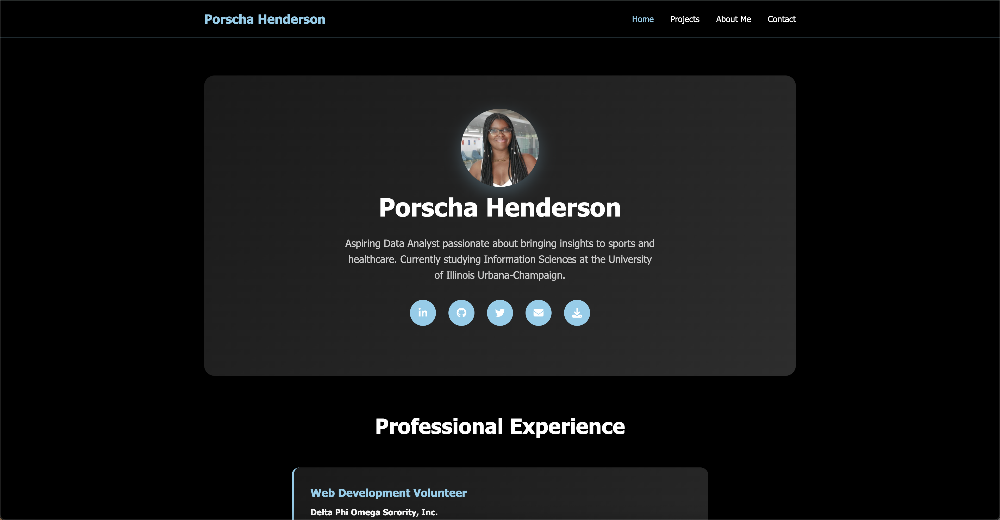

# 🌟 Welcome to My Portfolio Website!

**Live Site:** [pjordan2.github.io](https://pjordan2.github.io/)

 
  <kbd>
    
  </kbd>

---

### ✨ Features

⚡️ **Responsive Design:** Looks great on any device.\
⚡️ **Clean Layout:** Easy navigation and quick access to info.\
⚡️ **Interactive Elements:** Smooth transitions and engaging visuals.\
⚡️ **Project Showcase:** Each project comes with a brief description and links.\
⚡️ **Contact Form:** Directly reach out via the site.

### 🏡 What’s Inside?

Explore the following sections on my site:

✔️ **Home/About Me:** A quick introduction and background.\
✔️ **Projects:** Highlights of my favorite work and collaborations.\
✔️ **Contact:** Easy ways to get in touch—social links, email, and more.

### 🛠️ Tools & Tech Used

⚡️ **HTML5 & CSS3** for structure and styling.\
⚡️ **JavaScript** for interactive elements.\
⚡️ **Git & GitHub** for version control and hosting.\
⚡️ **GitHub Pages** for free static site hosting.\
⚡️ **Markdown** for documentation (like this README!).

---

**Thanks for visiting! If you like what you see, let’s [connect!](https://www.linkedin.com/in/porschahend/)** 😄
